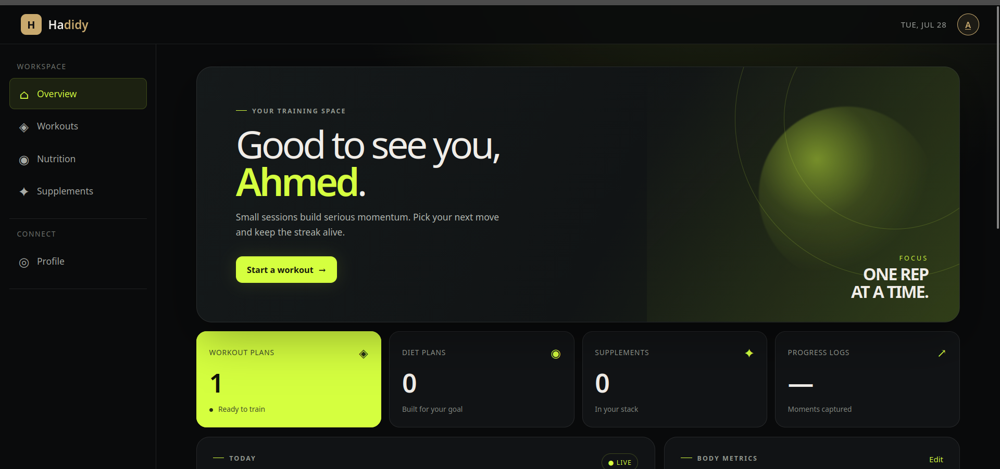
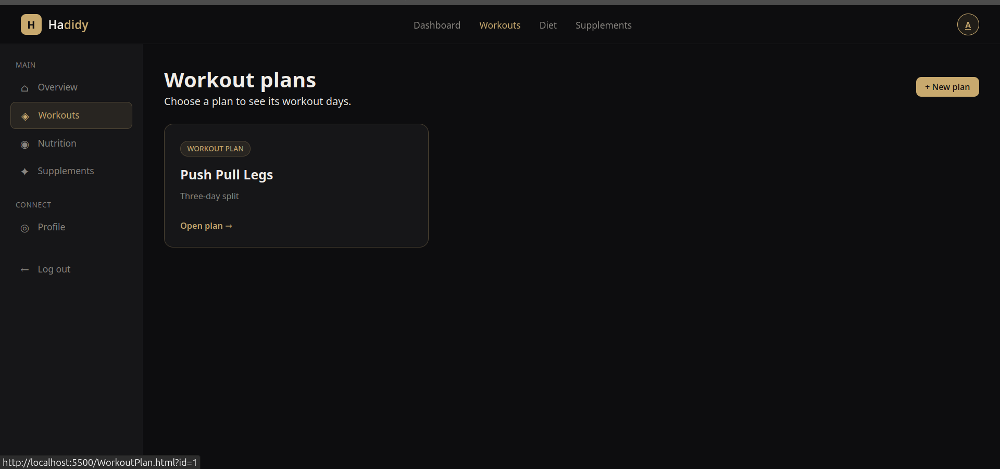
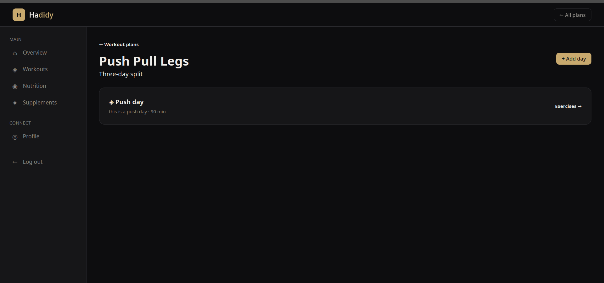
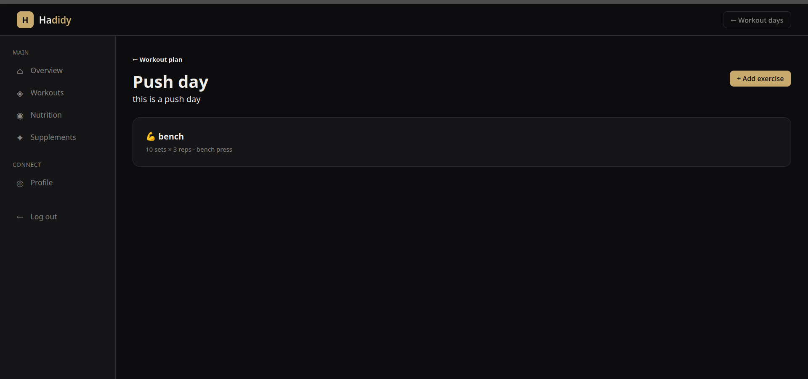
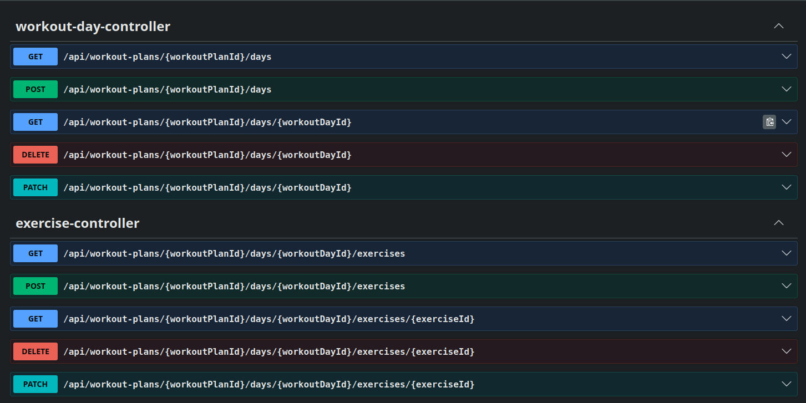
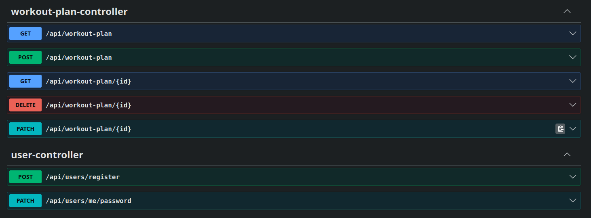
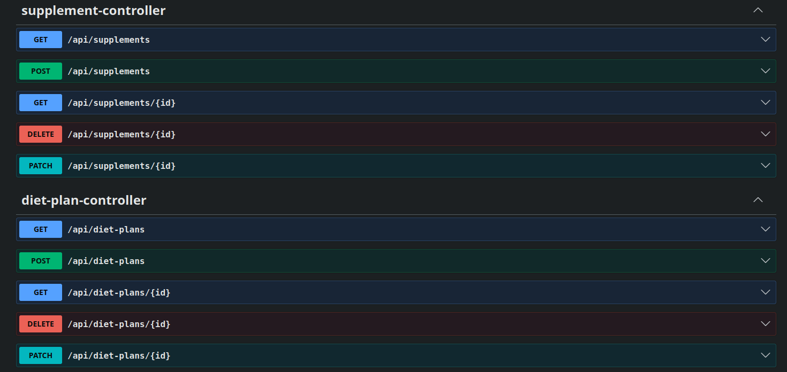
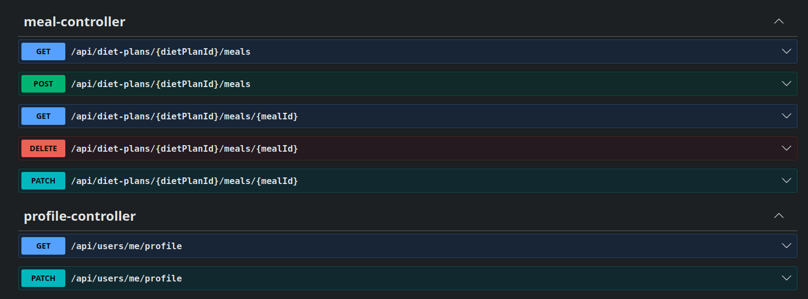

# 🏋️ Hadidy - Gym Tracker Backend

A production-ready **RESTful API** built with **Java 21** and **Spring Boot** for managing workouts, diet plans, meals, supplements, and user profiles.

The project follows a clean layered architecture using **Spring Security**, **Spring Data JPA**, **Hibernate**, **DTOs**, **Validation**, and **Global Exception Handling** to provide a secure, scalable, and maintainable backend application.

---

# ✨ Features

- 🔐 Secure User Authentication
- 👤 User Profile Management
- 💪 Workout Plans Management
- 📅 Workout Days Management
- 🏃 Exercise Management
- 🥗 Diet Plans Management
- 🍽️ Meal Management
- 💊 Supplement Management
- 📦 DTO-based API Responses
- ✅ Request Validation
- ⚠️ Global Exception Handling
- 🔒 Spring Security
- 🗄️ MySQL Database Integration
- 🏛️ Layered Architecture

---

# 📸 Application Preview

## 🏠 Home Dashboard

<p align="center">
    
</p>

---

## 💪 Workout Plans

<p align="center">
    
</p>

---

## 📅 Workout Days

<p align="center">
    
</p>

---

## 🏃 Exercises

<p align="center">
    
</p>

---

# 📖 API Documentation (Swagger)

<p align="center">
    
    
</p>

<p align="center">
    
    
</p>

---

# 🏗️ Architecture

```text
                HTTP Request
                     │
                     ▼
              REST Controller
                     │
                     ▼
                  Service
                     │
                     ▼
                Repository
                     │
                     ▼
             MySQL Database
```

The project follows a layered architecture that provides:

- Maintainability
- Scalability
- Readability
- Testability
- Separation of Concerns

---

# 🛠️ Tech Stack

### Backend

- Java 21
- Spring Boot
- Spring MVC
- Spring Security
- Spring Data JPA
- Hibernate

### Database

- MySQL

### Build Tool

- Maven

### Development Tools

- IntelliJ IDEA
- Git
- GitHub
- Postman
- Swagger / OpenAPI

---

# 📂 Project Structure

```text
src
├── config
├── controllers
├── dto
├── entity
├── exceptions
├── repository
├── service
└── HadidyApplication.java
```

---

# 📚 Main Modules

- Authentication
- User
- Profile
- Workout Plan
- Workout Day
- Exercise
- Diet Plan
- Meal
- Supplement
- Progress Tracking

---

# 🔐 Security

The application uses **Spring Security** to secure endpoints and authenticate users.

Current implementation includes:

- User Authentication
- Password Encryption using BCrypt
- Protected REST Endpoints
- Authentication-based Resource Access
- Foundation for Role-Based Authorization

---

# 📡 REST APIs

The backend exposes REST APIs for managing:

| Module | Status |
|---------|:------:|
| Authentication | ✅ |
| Users | ✅ |
| Profiles | ✅ |
| Workout Plans | ✅ |
| Workout Days | ✅ |
| Exercises | ✅ |
| Diet Plans | ✅ |
| Meals | ✅ |
| Supplements | ✅ |

Swagger screenshots above provide a quick overview of the available endpoints.

---

# 📖 Sample API

### Register User

#### Request

```http
POST /api/auth/register
```

```json
{
  "username": "Ahmed",
  "email": "ahmed@example.com",
  "password": "password123"
}
```

#### Response

```json
{
  "id": 1,
  "username": "Ahmed",
  "email": "ahmed@example.com"
}
```

---

# ⚙️ Getting Started

## 1. Clone the repository

```bash
git clone https://github.com/ahmed2005hussen/gymTracker-.git
```

---

## 2. Navigate to the project

```bash
cd gymTracker-
```

---

## 3. Configure MySQL

Update your `application.properties` file.

```properties
spring.datasource.url=jdbc:mysql://localhost:3306/gymtracker

spring.datasource.username=YOUR_USERNAME

spring.datasource.password=YOUR_PASSWORD
```

---

## 4. Build the project

```bash
mvn clean install
```

---

## 5. Run the application

```bash
mvn spring-boot:run
```

or

```bash
./mvnw spring-boot:run
```

---

# 🚀 Future Improvements

- JWT Authentication
- Refresh Tokens
- Role-Based Authorization
- Email Verification
- Password Reset
- Docker Support
- Unit Testing
- Integration Testing
- Pagination & Sorting
- Logging
- File Uploads
- CI/CD Pipeline

---

# 👨‍💻 Author

### Ahmed Hussein

**GitHub**

https://github.com/ahmed2005hussen

**LinkedIn**

https://linkedin.com/in/ahmed-elsherif-119b60337